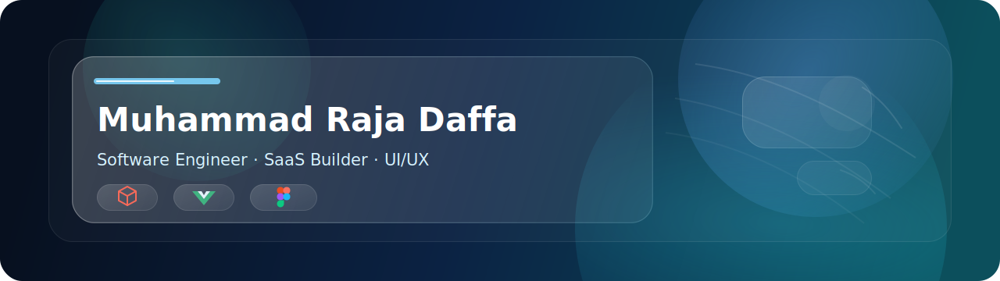

# 

<!-- <h1 align="center">Muhammad Raja Daffa</h1> -->

  <!-- <strong>Rza</strong>  -->
  ☕ Coding Enthusiast | 🎨 UI/UX | 🚀 SaaS Builder | ⛏️ Minecraft Server Developer

  <a href="https://rzadaffa.netlify.app">Portfolio</a>
  ·
  <a href="YOUR_LINKEDIN_URL">LinkedIn</a>
  ·
  <a href="https://www.tiktok.com/@rzadaffa_">TikTok</a>
  ·
  <a href="mailto:muhammadrajadaffa@gmail.com">Email</a>

## Tech Stack

  
  
  
  
  
  
  
  
  
  
  
  
  
  
  
  
  
  
  
  
  
  
  

### Minecraft Server Development

  
  
  
  
  
  
  
  

## Currently Building

Building SaaS products, full stack applications, and internal tools with a focus on reliability and practical value.

## Cybersecurity Fundamentals

  🐉 Kali Linux | 🌐 Network Security | 📶 Wireless Security | 🔍 Vulnerability Assessment | 📡 Network Monitoring

## GitHub Statistics

  

  

  

  <picture>
    <source media="(prefers-color-scheme: dark)" srcset="https://raw.githubusercontent.com/rhellokitty/rhellokitty/output/pacman-contribution-graph-dark.svg" />
    <source media="(prefers-color-scheme: light)" srcset="https://raw.githubusercontent.com/rhellokitty/rhellokitty/output/pacman-contribution-graph.svg" />
    
  </picture>

